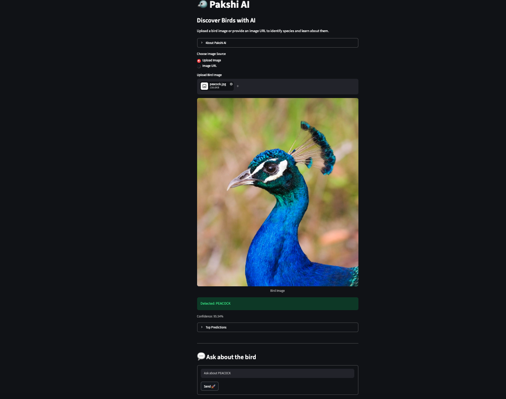
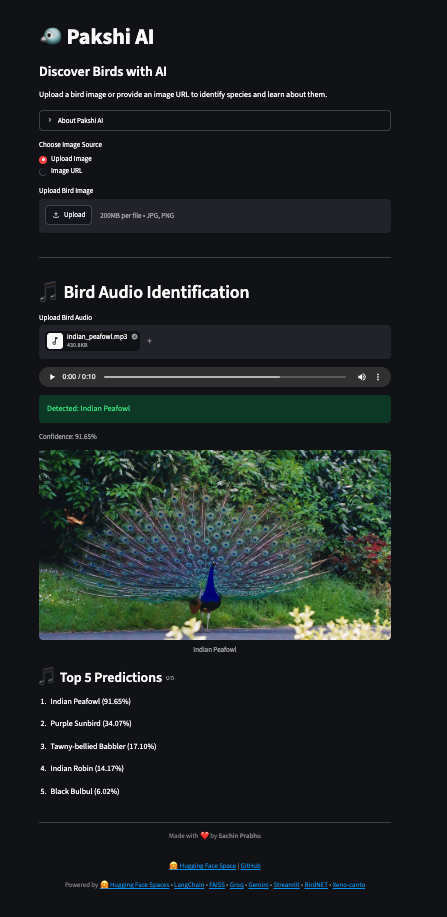
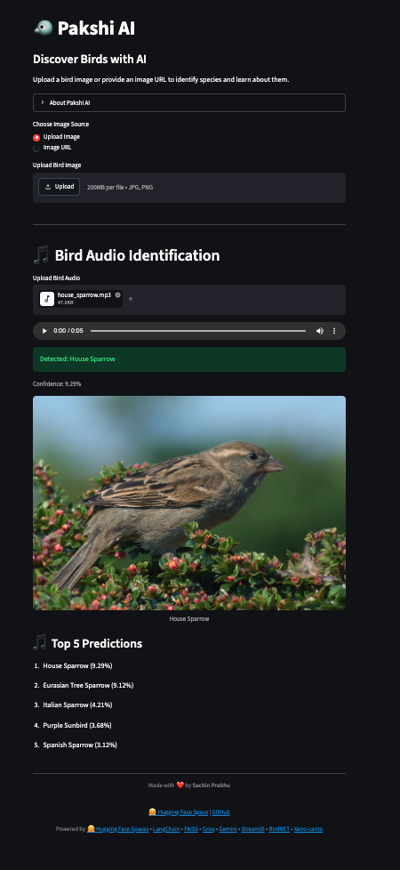

# 🐦 Pakshi AI

Pakshi AI is an AI-powered bird identification and learning assistant.

Upload a bird image or provide an image URL to identify bird species and learn about their habitat, diet, conservation status, and interesting facts.

## App screenshots 

<p align="center">
  
</p>

<p align="center">
  
</p>

<p align="center">
  
</p>

<p align="center">
  
</p>


<p align="center">
  
</p>


## Live Demo

🤗 **Hugging Face Space:** https://huggingface.co/spaces/sachinprabhu007/pakshi-ai

## Features

* 🖼️ Bird species identification from images
* 🎵 Bird species identification from audio (BirdNET)
* 🔗 Support for image URLs
* 📚 Retrieval-Augmented Generation (RAG) using FAISS
* 🤖 Gemini fallback for unsupported bird species
* 💬 Conversational bird assistant
* ⚡ Powered by Groq and Google Gemini

## 🎵 Audio-Based Bird Detection (BirdNET)

Pakshi AI supports bird identification from audio recordings using the BirdNET analyzer.

### How it works

Audio input (.mp3 / .wav / .flac) → BirdNET Analyzer → CSV Output → Post-processing → Top predictions

```text
User Uploads Audio
        ↓
audio_detector.py
        ↓
BirdNET Analyzer
        ↓
CSV Output (birdnet_output/)
        ↓
Parse & Extract Predictions
        ↓
Top 5 species returned along with confidence percentages.
```

## Architecture

<p align="center">
  
</p>


```text
User
 ↓
Streamlit Frontend
 ↓
Application Backend (Hugging Face Space)
 ↓
Load Image (Upload or URL (Image or Audio))
 ↓
Bird Classifier (Hugging Face Model (Image) / BirdNET (Audio))
 ↓
Confidence ≥ 90% ?

├── No
│     ↓
│   Show Top Predictions
│   Request Better Image
│
└── Yes
      ↓
   Knowledge Base Available?

   ├── Yes
   │     ↓
   │   FAISS Retrieval
   │     ↓
   │   Groq LLM (RAG)
   │     ↓
   │   Grounded Response
   │
   └── No
         ↓
       Gemini LLM
         ↓
       AI-Generated Response

      ↓
   Display Results
```

### 📄 Species Knowledge Files

Each bird species is represented by a dedicated text (`.txt`) file containing structured information such as its common name, scientific name, habitat, diet, conservation status, description, and interesting facts. These files serve as the knowledge base for the RAG pipeline, enabling Pakshi AI to provide accurate and species-specific information.

**Example (`house_sparrow.txt`):**
Example file: [house_sparrow.txt](data/birds/house_sparrow.txt)

```text
Name: House Sparrow

Scientific Name: Passer domesticus

Habitat:
Urban and rural settlements.

Diet:
Grains, seeds and insects.

Conservation Status:
Least Concern

Description:
The House Sparrow is a small bird commonly found near human habitation.

Interesting Facts:
- One of the most widespread bird species in the world.
- Often nests in buildings and roof spaces.
```

**Conservation Status** indicates the risk of extinction of a species according to the IUCN Red List. For example, the House Sparrow is classified as **Least Concern**, meaning it is widespread and abundant globally. Other possible categories include Near Threatened, Vulnerable, Endangered, Critically Endangered, Extinct in the Wild, and Extinct.


## Tech Stack

* Streamlit
* Hugging Face Transformers
* LangChain
* FAISS
* Groq
* Google Gemini
* Hugging Face Spaces
* BirdNET Analyzer – Audio-based bird species detection

### 🧠 AI / ML Models
* Hugging Face Transformers – Image classification
* BirdNET Analyzer – Audio-based bird species detection

## Setup

### Create Environment

```bash
conda create -n birdrag python=3.11 -y
conda activate birdrag
```

### Install Dependencies

```bash
pip install -r requirements.txt
```

### Configure Environment Variables

Create a `.env` file:

```env
GROQ_API_KEY=your_groq_api_key
GOOGLE_API_KEY=your_google_api_key
```

### Build Vector Database

```bash
python scripts/build_vector_db.py
```

### Run Application

```bash
streamlit run app.py
```

## Knowledge Base

Bird information is stored as text files under:

```text
data/birds/
```

After adding or updating bird files, rebuild the vector database:

```bash
python scripts/build_vector_db.py
```

## Deployment

Pakshi AI is deployed on Hugging Face Spaces.

🔗 Live Demo: https://huggingface.co/spaces/sachinprabhu007/pakshi-ai


## 🌿 Branch Strategy

This project follows a multi-branch workflow to separate development, experimentation, and deployment concerns.

---

### 🧠 `main` (Source of Truth)
- Primary development branch
- Contains full source code, documentation, architecture diagrams, and screenshots
- Used for overall project evolution and reference
- Not deployed directly to production

---

### ⚙️ `audio-detect` (Feature / Experimental Branch)
- Dedicated branch for BirdNET audio detection feature
- Used for experimenting and improving audio-based classification
- May include unstable or evolving implementations
- Merged into deployment branch after validation

---

### 🚀 `hf-deploy` (Production Deployment Branch)
- Clean, production-ready branch for Hugging Face Spaces
- Contains only required application code
- Excludes:
  - `samples/`
  - `uploads/`
  - `birdnet_output/`
  - large assets or experimental files
- Ensures lightweight and stable deployment

---

## 🔁 Workflow Summary

```text
main → feature development reference
   ↓
audio-detect → audio experimentation
   ↓
hf-deploy → production deployment (Hugging Face Spaces)

```

### 🚀 Deployment Rule

Only the hf-deploy branch is deployed to Hugging Face Spaces:

```
git push hf hf-deploy:main
```

## 🚀 Hugging Face Spaces Deployment

To deploy Pakshi AI on Hugging Face Spaces, you will need:

1. A Hugging Face account.
2. A Hugging Face Space configured with the Streamlit SDK.
3. Required API keys added as Space Secrets:

   * `GROQ_API_KEY`
   * `GOOGLE_API_KEY` (if using Gemini)
4. The deployment branch (`hf-deploy`) pushed to your Hugging Face Space repository.

### Setting Up Secrets

In your Hugging Face Space:

**Settings → Repository Secrets**

Add the required API keys as secrets so they are securely available to the application at runtime.

For more details, refer to:

* Hugging Face Spaces: https://huggingface.co/spaces
* Spaces Configuration Reference: https://huggingface.co/docs/hub/spaces-config-reference
* Managing Secrets: https://huggingface.co/docs/hub/spaces-overview#managing-secrets


### Environment Variables
Configure in Hugging Face Space Settings:

* GROQ_API_KEY
* GOOGLE_API_KEY

## Project Structure

```text
pakshi_ai/
.
├── __pycache__
│   └── audio_detector.cpython-311.pyc
│
├── app.py
├── audio_detector.py
├── Dockerfile
├── README.md
├── requirements.txt
│
├── assets
│   ├── app_screenshot_1.png
│   ├── app_screenshot_2.png
│   ├── app_screenshot_3.png
│   ├── app_screenshot_4.png
│   ├── app_screenshot_5.png
│   ├── eagle.jpg
│   ├── house sparrow.jpg
│   ├── pakshi_ai_uml_diagram.png
│   ├── parrot.jpeg
│   ├── peacock.jpg
│   └── sparrow.jpeg
│
├── data
│   └── birds
│       ├── house_sparrow.txt
│       └── peacock.txt
│
├── scripts
│   └── build_vector_db.py
│
├── src
│   ├── classifier.py
│   ├── rag.py
│   ├── streamlit_app.py
│   ├── vector_store.py
│   └── __pycache__
│       ├── classifier.cpython-311.pyc
│       ├── rag.cpython-311.pyc
│       └── vector_store.cpython-311.pyc
│
├── vector_db
│   ├── index.faiss
│   └── index.pkl
│
├── samples
│   ├── house_sparrow.mp3
│   └── indian_peafowl.mp3
│
├── uploads
│   ├── house_sparrow.mp3
│   └── indian_peafowl.mp3
│
└── birdnet_output
    ├── BirdNET_analysis_params.csv
    ├── house_sparrow.BirdNET.results.csv
    └── indian_peafowl.BirdNET.results.csv
```

### ❌ Not Needed (for Git / HF / Production)
```
__pycache__/
assets/
samples/
uploads/
birdnet_output/
```

## 🧩 Key Components

### 🖥️ Core Application
- **app.py** – Streamlit application and main user interface

---

### 🖼️ Image-Based Detection
- **classifier.py** – Bird species detection using Hugging Face Transformers  
  - Processes uploaded images or image URLs  
  - Returns top species predictions with confidence scores  

---

### 🎵 Audio-Based Detection
- **audio_detector.py** – Bird species detection from audio using BirdNET Analyzer  
  - Processes `.mp3`, `.wav`, `.flac` audio files  
  - Runs BirdNET inference on audio segments  
  - Generates CSV output with predictions  
  - Parses results and returns top species with confidence scores  

---

### 🧠 RAG & Knowledge System
- **rag.py** – Retrieval-Augmented Generation pipeline  
  - Uses FAISS for similarity search  
  - Groq LLM for fast response generation  
  - Gemini as fallback for missing knowledge  

- **vector_store.py** – Handles FAISS vector database creation and querying  

---

### 📚 Data Layer
- **data/birds/** – Structured bird knowledge base (`.txt` files per species)  
- **vector_db/** – Stored FAISS index and embeddings for retrieval  

---

### 🧪 Development & Utilities
- **scripts/build_vector_db.py** – Script to generate/update FAISS vector database  
- **assets/** – UI images, screenshots, and architecture diagrams  

---

### 📁 Runtime / Temporary Data (Not part of core system)
- **uploads/** – Temporary storage for user-uploaded audio files  
- **samples/** – Local test audio files used during development  
- **birdnet_output/** – CSV outputs generated by BirdNET after audio processing  

---

## 🧠 System Overview

Pakshi AI is a **multimodal bird intelligence system** combining:
- 🖼️ Image-based classification  
- 🎵 Audio-based BirdNET detection  
- 🧠 RAG-based knowledge retrieval  
- 🤖 LLM-powered reasoning  

## Author

Made with ❤️ by Sachin Prabhu
