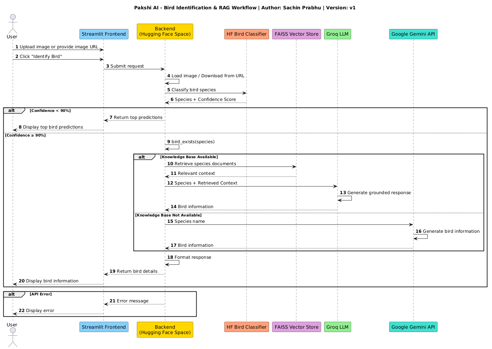

# 🐦 Pakshi AI

Pakshi AI is an AI-powered bird identification and learning assistant.

Upload a bird image or provide an image URL to identify bird species and learn about their habitat, diet, conservation status, and interesting facts.

## Live Demo

🤗 **Hugging Face Space:** https://huggingface.co/spaces/sachinprabhu007/pakshi-ai

## Features

* 🖼️ Bird species identification from images
* 🔗 Support for image URLs
* 📚 Retrieval-Augmented Generation (RAG) using FAISS
* 🤖 Gemini fallback for unsupported bird species
* 💬 Conversational bird assistant
* ⚡ Powered by Groq and Google Gemini

## Architecture

<p align="center">
  
</p>


```text
User
 ↓
Streamlit Frontend
 ↓
Application Backend (Hugging Face Space)
 ↓
Load Image (Upload or URL)
 ↓
Bird Classifier (Hugging Face Model)
 ↓
Confidence ≥ 90% ?

├── No
│     ↓
│   Show Top Predictions
│   Request Better Image
│
└── Yes
      ↓
   Knowledge Base Available?

   ├── Yes
   │     ↓
   │   FAISS Retrieval
   │     ↓
   │   Groq LLM (RAG)
   │     ↓
   │   Grounded Response
   │
   └── No
         ↓
       Gemini LLM
         ↓
       AI-Generated Response

      ↓
   Display Results
```

## Tech Stack

* Streamlit
* Hugging Face Transformers
* LangChain
* FAISS
* Groq
* Google Gemini
* Hugging Face Spaces

## Setup

### Create Environment

```bash
conda create -n birdrag python=3.11 -y
conda activate birdrag
```

### Install Dependencies

```bash
pip install -r requirements.txt
```

### Configure Environment Variables

Create a `.env` file:

```env
GROQ_API_KEY=your_groq_api_key
GOOGLE_API_KEY=your_google_api_key
```

### Build Vector Database

```bash
python scripts/build_vector_db.py
```

### Run Application

```bash
streamlit run app.py
```

## Knowledge Base

Bird information is stored as text files under:

```text
data/birds/
```

After adding or updating bird files, rebuild the vector database:

```bash
python scripts/build_vector_db.py
```

## Deployment

Pakshi AI is deployed on Hugging Face Spaces.

🔗 Live Demo: https://huggingface.co/spaces/sachinprabhu007/pakshi-ai

### Environment Variables
Configure in Hugging Face Space Settings:

* GROQ_API_KEY
* GOOGLE_API_KEY

## Project Structure

```text
pakshi_ai/
├── app.py
├── README.md
├── requirements.txt
├── .env.example
│
├── assets/
│   ├── eagle.jpg
│   ├── house_sparrow.jpg
│   ├── parrot.jpeg
│   ├── peacock.jpg
│   └── sparrow.jpeg
│
├── data/
│   └── birds/
│       ├── house_sparrow.txt
│       └── peacock.txt
│
├── scripts/
│   └── build_vector_db.py
│
├── src/
│   ├── classifier.py
│   ├── rag.py
│   └── vector_store.py
│
├── vector_db/
│   ├── index.faiss
│   └── index.pkl
│
└── .gitignore
```

### Key Components

* **app.py** – Streamlit application and user interface
* **classifier.py** – Bird species detection using Hugging Face Transformers
* **rag.py** – RAG pipeline using FAISS, Groq, and Gemini fallback
* **vector_store.py** – Builds and persists the FAISS vector database
* **data/birds/** – Curated bird knowledge base
* **vector_db/** – FAISS index and metadata
* **assets/** – Sample bird images for testing
* **scripts/build_vector_db.py** – Script to generate the vector database

```
```


## Author

Made with ❤️ by Sachin Prabhu
