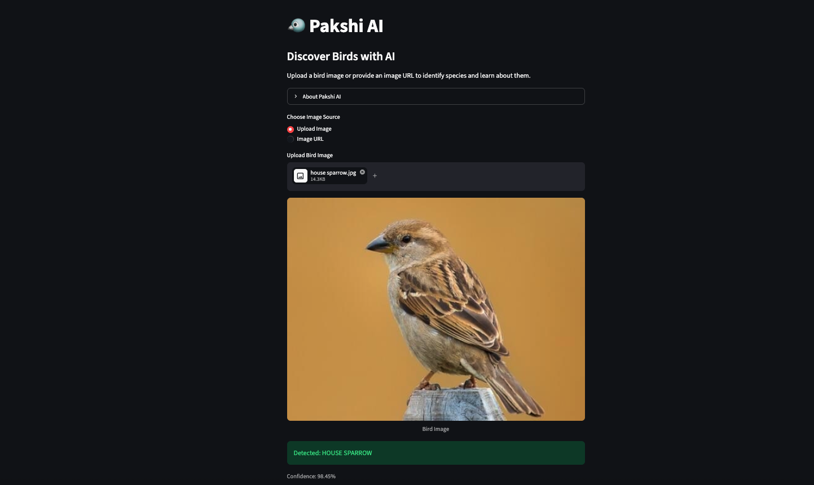
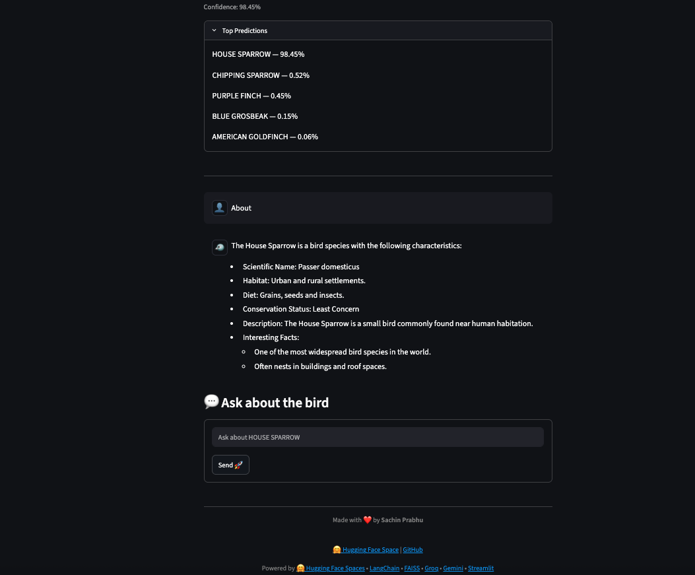

# 🐦 Pakshi AI

Pakshi AI is an AI-powered bird identification and learning assistant.

Upload a bird image or provide an image URL to identify bird species and learn about their habitat, diet, conservation status, and interesting facts.

## App screenshots 

<p align="center">
  
</p>

<p align="center">
  
</p>

## Live Demo

🤗 **Hugging Face Space:** https://huggingface.co/spaces/sachinprabhu007/pakshi-ai

## Features

* 🖼️ Bird species identification from images
* 🔗 Support for image URLs
* 📚 Retrieval-Augmented Generation (RAG) using FAISS
* 🤖 Gemini fallback for unsupported bird species
* 💬 Conversational bird assistant
* ⚡ Powered by Groq and Google Gemini

## Architecture

<p align="center">
  
</p>


```text
User
 ↓
Streamlit Frontend
 ↓
Application Backend (Hugging Face Space)
 ↓
Load Image (Upload or URL)
 ↓
Bird Classifier (Hugging Face Model)
 ↓
Confidence ≥ 90% ?

├── No
│     ↓
│   Show Top Predictions
│   Request Better Image
│
└── Yes
      ↓
   Knowledge Base Available?

   ├── Yes
   │     ↓
   │   FAISS Retrieval
   │     ↓
   │   Groq LLM (RAG)
   │     ↓
   │   Grounded Response
   │
   └── No
         ↓
       Gemini LLM
         ↓
       AI-Generated Response

      ↓
   Display Results
```

### 📄 Species Knowledge Files

Each bird species is represented by a dedicated text (`.txt`) file containing structured information such as its common name, scientific name, habitat, diet, conservation status, description, and interesting facts. These files serve as the knowledge base for the RAG pipeline, enabling Pakshi AI to provide accurate and species-specific information.

**Example (`house_sparrow.txt`):**

```text
Name: House Sparrow

Scientific Name: Passer domesticus

Habitat:
Urban and rural settlements.

Diet:
Grains, seeds and insects.

Conservation Status:
Least Concern

Description:
The House Sparrow is a small bird commonly found near human habitation.

Interesting Facts:
- One of the most widespread bird species in the world.
- Often nests in buildings and roof spaces.
```

**Conservation Status** indicates the risk of extinction of a species according to the IUCN Red List. For example, the House Sparrow is classified as **Least Concern**, meaning it is widespread and abundant globally. Other possible categories include Near Threatened, Vulnerable, Endangered, Critically Endangered, Extinct in the Wild, and Extinct.


## Tech Stack

* Streamlit
* Hugging Face Transformers
* LangChain
* FAISS
* Groq
* Google Gemini
* Hugging Face Spaces

## Setup

### Create Environment

```bash
conda create -n birdrag python=3.11 -y
conda activate birdrag
```

### Install Dependencies

```bash
pip install -r requirements.txt
```

### Configure Environment Variables

Create a `.env` file:

```env
GROQ_API_KEY=your_groq_api_key
GOOGLE_API_KEY=your_google_api_key
```

### Build Vector Database

```bash
python scripts/build_vector_db.py
```

### Run Application

```bash
streamlit run app.py
```

## Knowledge Base

Bird information is stored as text files under:

```text
data/birds/
```

After adding or updating bird files, rebuild the vector database:

```bash
python scripts/build_vector_db.py
```

## Deployment

Pakshi AI is deployed on Hugging Face Spaces.

🔗 Live Demo: https://huggingface.co/spaces/sachinprabhu007/pakshi-ai


## 🌿 Branch Strategy

This project maintains two branches for different purposes:

* **`main`** – Primary development branch containing the complete source code, documentation, screenshots, architecture diagrams, and other repository assets.
* **`hf-deploy`** – Deployment branch used for Hugging Face Spaces. To keep the deployment lightweight and focused on the application code, documentation assets such as screenshots and diagrams from the `assets/` directory are omitted.

As a result, some images and documentation elements available in the GitHub repository may not be present in the Hugging Face Spaces deployment.


## 🚀 Hugging Face Spaces Deployment

To deploy Pakshi AI on Hugging Face Spaces, you will need:

1. A Hugging Face account.
2. A Hugging Face Space configured with the Streamlit SDK.
3. Required API keys added as Space Secrets:

   * `GROQ_API_KEY`
   * `GOOGLE_API_KEY` (if using Gemini)
4. The deployment branch (`hf-deploy`) pushed to your Hugging Face Space repository.

### Setting Up Secrets

In your Hugging Face Space:

**Settings → Repository Secrets**

Add the required API keys as secrets so they are securely available to the application at runtime.

For more details, refer to:

* Hugging Face Spaces: https://huggingface.co/spaces
* Spaces Configuration Reference: https://huggingface.co/docs/hub/spaces-config-reference
* Managing Secrets: https://huggingface.co/docs/hub/spaces-overview#managing-secrets


### Environment Variables
Configure in Hugging Face Space Settings:

* GROQ_API_KEY
* GOOGLE_API_KEY

## Project Structure

```text
pakshi_ai/
├── app.py
├── README.md
├── requirements.txt
├── .env.example
│
├── assets/
│   ├── eagle.jpg
│   ├── house_sparrow.jpg
│   ├── parrot.jpeg
│   ├── peacock.jpg
│   └── sparrow.jpeg
│
├── data/
│   └── birds/
│       ├── house_sparrow.txt
│       └── peacock.txt
│
├── scripts/
│   └── build_vector_db.py
│
├── src/
│   ├── classifier.py
│   ├── rag.py
│   └── vector_store.py
│
├── vector_db/
│   ├── index.faiss
│   └── index.pkl
│
└── .gitignore
```

### Key Components

* **app.py** – Streamlit application and user interface
* **classifier.py** – Bird species detection using Hugging Face Transformers
* **rag.py** – RAG pipeline using FAISS, Groq, and Gemini fallback
* **vector_store.py** – Builds and persists the FAISS vector database
* **data/birds/** – Curated bird knowledge base
* **vector_db/** – FAISS index and metadata
* **assets/** – Sample bird images for testing
* **scripts/build_vector_db.py** – Script to generate the vector database

```
```


## Author

Made with ❤️ by Sachin Prabhu
